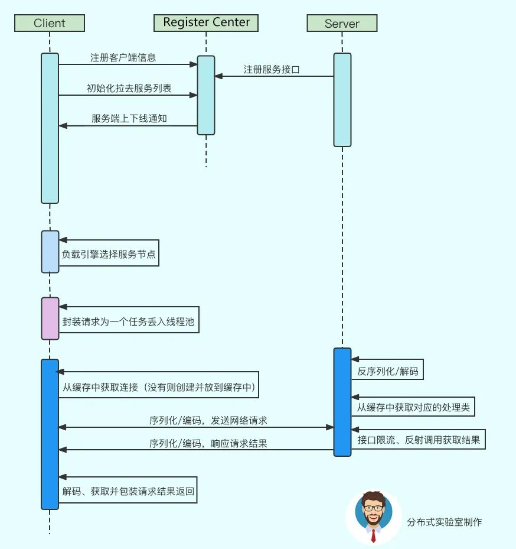
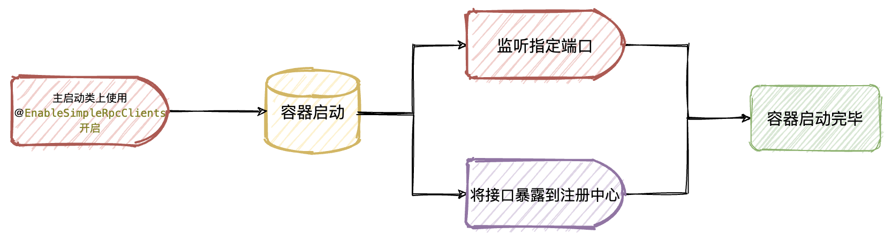
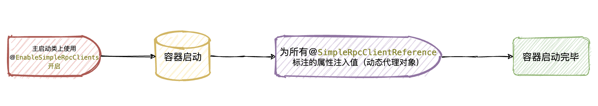

## 一、项目介绍

### ①、项目技术栈

- JDK8、maven

- netty底层通信原理

- nacas注册中心、nacos客户端使用

- 反射以及使用本地缓存优化反射效率

- springboot自动配置、自定义starter、参数映射、自定义注解 + spring启动过程中注入自定义bean、spring容器事件监听、自定义starter基于注解实现动态插拔

- 动态代理、枚举高级用法、定制序列化算法等

- JUC相关知识，线程池，double check单例

- JVM钩子函数运用

  

### ②、项目基础介绍

【 simple-rpc】是一款简单的rpc服务框架，主要用于学习造轮子！以便于透彻的理解RPC原理和过程，以及`spring、springboot、netty`中相关技术运用。

【 simple-rpc】主要实现了两个版本

- 【`simple-rpc-like-feign`分支】实现了类似于openfeign调用相关功能（openFeign底层通信是基于HTTP，一般是使用HttpClient等相关HTTP客户端发起的调用（这也是openfeign比较低效的原因之一）。在`simple-rpc-like-feign`分支中将底层通信替换为了`netty`）。但在使用方式上和openfeign非常相似，使用上非常便捷。
- 【`master`分支】实现了类似dubbo rpc相关功能（底层通信基于netty），使用上和dubbo比较类似。
- 下面主要介绍`master`分支实现的功能！！！


### ③、项目核心功能说明

- 该项目实现了一个简单rpc调用，使用上类似于dubbo，非常方便，只需要基于一个`[注解 + 接口]`就能完成远程调用。
  - 很多人认为feign是伪RPC，有一定的道理，可参考：[https://www2.zhihu.com/question/298707085](https://www2.zhihu.com/question/298707085)
- 以nacos作为注册中心（后面可拓展为支持多种类型的注册中心）
- 消息序列化算法可由使用方动态配置（目前支持Java、JSON两种序列化算法）
- 底层基于netty实现【服务提供方】和【服务消费方】进行通信，并且使用自定义消息编码解码器（`MessageCodecSharable`和`ProtocolFrameDecoder`）解决消息粘包和半包问题
  - 自定义rpc请求消息和rpc响应消息的编码解码器`LengthFieldBasedFrameDecoder`，自定义消息发送的格式。
  - 自定义帧解码器(预设长度解码器)`ProtocolFrameDecoder`，按自定义规则解码入站消息。
- 基于netty提供的promise进行异步rpc调用，调用方并不用同步等待结果响应
- 动态可插拔，基于`@EnableSimpleRpcClients`注解开启或关闭simple rpc功能
- 在调用方只需要使用`@SimpleRpcClientReference`注解注入远程rpc接口，就可以进行RPC调用（像调用本地方法一样去进行远程调用）
- server端，在底层netty通信时提供了`RpcRequestMessageHandlerExecutor`线程池，支持用户动态配置或覆盖默认线程池，提升通信channel的效率


## 二、启动步骤

首先要搞清楚如何将项目先正常跑起来，测试一把然后再去关注具体实现！

- 拉取项目到本地，并且在idea中打开[https://gitee.com/mr_wenpan/basis-simple-rpc](https://gitee.com/mr_wenpan/basis-simple-rpc)
- 将`simple-rpc-starter`模块执行`mvn clean install`到本地maven仓库
- `simple-rpc-provider`和`simple-rpc-consumer`这两个测试模块的`application.yml`配置文件中开启相关配置
  - 主要配置simple rpc server端监听的端口（默认8888端口）
  - rpc调用最大等待时间（默认1分钟）
  - nacos注册中心地址
- `simple-rpc-provider`和`simple-rpc-consumer`模块启动类上使用`@EnableSimpleRpcClients`注解开启simple rpc功能
- 启动`simple-rpc-provider`模块
- 启动`simple-rpc-consumer`模块
- 浏览器请求接口：[http://localhost:8081/v1/consumer-hello?name=xxxx](http://localhost:8081/v1/consumer-hello?name=wenpan)
- 观察浏览器返回和两个服务的控制台输出

当然上面的步骤在工程源代码里已经配置好了，只需要把代码拉下来，然后将nacos地址替换掉，直接启动运行就可以了。


## 三、RPC简单介绍

- 首先了解一下RPC的大体流程
- 相关理论介绍
  - [用通俗的语言解释一下什么是 RPC 框架](https://www.zhihu.com/question/25536695)
  - [浅谈RPC调用](https://www.cnblogs.com/linlinismine/p/9205676.html)
  - [远程过程调用(RPC)详解)](https://my.oschina.net/waylau/blog/709372)
  - [通俗的解释一下什么是 RPC 框架](https://cloud.tencent.com/developer/article/1165885)
  - [feign调用原理浅析](https://www.jianshu.com/p/e0218c142d03)

### ①、大致流程


### ②、时序图




## 四、Simple Rpc整体结构


## 五、服务提供方和服务消费方启动流程简述

### ①、服务提供方启动流程简述




### ②、服务消费方启动流程简述



## 六、核心代码

### 1、客户端代理对象创建

```java
public class SimpleRpcClientReferencePostProcessor implements BeanPostProcessor {

    private static final Map<Class<?>, Object> SIMPLE_RPC_REFERENCE_MAP = new ConcurrentHashMap<>();

    /**
     * bean初始化之前
     *
     * @param bean     bean
     * @param beanName bean名称
     * @return java.lang.Object
     * @author Mr_wenpan@163.com 2022/1/24 12:47 下午
     */
    @Override
    public Object postProcessBeforeInitialization(Object bean, String beanName) throws BeansException {
        // 扫描含有@SimpleRpcClientReference注解的类
        Class<?> objClz = AopUtils.isAopProxy(bean) ? AopUtils.getTargetClass(bean) : bean.getClass();
        try {
            for (Field field : objClz.getDeclaredFields()) {
                SimpleRpcClientReference reference = field.getAnnotation(SimpleRpcClientReference.class);
                if (Objects.isNull(reference)) {
                    continue;
                }
                // 创建代理对象
                Object proxyService = getProxyService(field.getType());
                // 反射设置属性值
                field.setAccessible(true);
                ReflectionUtils.setField(field, bean, proxyService);
            }
        } catch (Exception e) {
            throw new BeanCreationException(beanName, e);
        }
        return bean;
    }

    @Override
    public Object postProcessAfterInitialization(Object bean, String beanName) throws BeansException {

        return bean;
    }

    /**
     * 获取代理对象，先从缓存中获取，如果本地缓存中没有则创建一个代理对象并返回
     *
     * @param type 类型
     * @return java.lang.Object 代理对象
     * @author Mr_wenpan@163.com 2022/1/24 4:05 下午
     */
    private static Object getProxyService(Class<?> type) {
        Assert.isTrue(type.isInterface(), "@SimpleRpcClientReference can only be specified on interface");
        // double check
        Object target = SIMPLE_RPC_REFERENCE_MAP.get(type);

        if (target != null) {
            return target;
        }

        synchronized (SimpleRpcClientReferencePostProcessor.class) {
            target = SIMPLE_RPC_REFERENCE_MAP.get(type);
            if (target != null) {
                return target;
            }
            target = SimpleRpcClientProxyCreateFactory.createProxyService(type);
            SIMPLE_RPC_REFERENCE_MAP.put(type, target);
            return target;
        }

    }

}
```


```java
@Slf4j
public class SimpleRpcClientProxyCreateFactory {

    /**
     * 通过接口的class创建该接口的代理对象(这里直接基于JDK提供的创建动态代理的工具来创建代理对象)
     *
     * @param serviceClass 接口的class
     * @return T 代理对象
     */
    public static <T> T createProxyService(Class<T> serviceClass) {
        // 该接口的Class对象是被那个类加载器加载的
        ClassLoader classLoader = serviceClass.getClassLoader();
        // 获取到该接口所有的interface(这里先假设就只有一个接口)
        Class<?>[] interfaces = {serviceClass};

        // jdk代理必须的handler，代理对象的方法执行就会调用这里的invoke方法。自动传入调用的方法 + 方法参数
        InvocationHandler invocationHandler = new InvocationHandler() {
            @Override
            public Object invoke(Object proxy, Method method, Object[] args) throws Throwable {
                // 1、将方法调用转换为rpc请求消息(sequenceId为消息唯一编号，当请求响应时可以通过这个ID找到对应的等待的Promise，然后唤醒)
                int sequenceId = SequenceIdGenerator.nextId();
                // 封装RPC请求消息
                RpcRequestMessage rpcRequestMessage = new RpcRequestMessage(sequenceId,
                        serviceClass.getName(),
                        method.getName(),
                        method.getReturnType(),
                        method.getParameterTypes(),
                        args);

                // 2、将消息对象发送出去(这里channel不会阻塞等待消息返回)
                Channel channel = getChannelByProviderInfName(serviceClass.getName());
                channel.writeAndFlush(rpcRequestMessage);
                System.out.println("channel.writeAndFlush(rpcRequestMessage);");

                // 3、准备一个空的promise对象来接收server返回的结果
                // 指定promise对象异步接收结果的线程，这里使用发送消息的channel的线程来接收消息（getChannel().eventLoop()）
                DefaultPromise<Object> promise = new DefaultPromise<>(channel.eventLoop());

                // 将这个promise缓存起来，以便于server响应结果回来的时候能够通过消息的sequenceId正确的找到这个promise
                // 那么这个promise在哪里接收的结果呢？当然是在响应handler里，因为只有当server端响应了promise才应该被设置值
                RpcResponseMessageHandler.PROMISES.put(sequenceId, promise);

                // 调用接口的线程等待，直到promise有结果（正常或异常）
                SimpleRpcProperties simpleRpcProperties = ApplicationContextHelper.getContext().getBean(SimpleRpcProperties.class);
                promise.await(simpleRpcProperties.getMaxWaitTime() * 1000);

                System.out.println("promise结果已返回, promise = " + promise.toString());
                // server返回结果后结束上面的阻塞，执行这里
                if (promise.isSuccess()) {
                    return promise.getNow();
                } else {
                    throw new SimpleRpcCallFailedException(String.format(
                            "simple rpc call failed, interface providerName is : [%s]", serviceClass.getName()), promise.cause());
                }
            }
        };

        Object proxy = Proxy.newProxyInstance(classLoader, interfaces, invocationHandler);

        // 返回代理对象
        return (T) proxy;
    }

    /**
     * 同步锁对象
     */
    private static final Object LOCK = new Object();

    /**
     * 获取唯一的 channel 对象(需要通过这个channel将数据发送给server端)
     */
    public static Channel getChannelByProviderInfName(@NonNull String interfaceName) throws NacosException {
        // 从nacos上随机获取一个可用的服务提供者实例
        NacosRegistrarManager nacosRegistrarManager = ApplicationContextHelper.getContext().getBean(NacosRegistrarManager.class);
        Instance instance = nacosRegistrarManager.getRandomInstanceByServerName(interfaceName);
        if (Objects.isNull(instance)) {
            throw new NoInstancesAvailableException(String.format("can not found available instance by service name [%s]", interfaceName));
        }
        // [服务名 + ip + 端口] 确定provider的唯一性
        String ip = instance.getIp();
        int port = instance.getPort();
        String serviceName = instance.getServiceName();
        String uniqueKey = serviceName + ip + SimpleRpcConstants.Symbol.COLON + port;
        Channel channel = SimpleRpcServerChannelRegistrar.getChannel(uniqueKey);

        if (Objects.nonNull(channel)) {
            return channel;
        }

        return initProviderChannel(serviceName, ip, port);
    }

    /**
     * 初始化到provider 的 channel
     *
     * @param serviceName serviceName
     * @param ip          provider的ip
     * @param port        provider监听的端口
     * @return io.netty.channel.Channel
     * @author Mr_wenpan@163.com 2022/1/21 11:51 上午
     */
    private static Channel initProviderChannel(String serviceName, String ip, int port) {
        // 唯一key
        String uniqueKey = serviceName + ip + SimpleRpcConstants.Symbol.COLON + port;
        Channel channel = SimpleRpcServerChannelRegistrar.getChannel(uniqueKey);
        // 双重检查
        if (Objects.nonNull(channel)) {
            return channel;
        }
        synchronized (LOCK) {
            // 通过uniqueKey获取到某个provider的channel
            channel = SimpleRpcServerChannelRegistrar.getChannel(uniqueKey);
            if (Objects.nonNull(channel)) {
                return channel;
            }
            // 创建到该provider的一个新channel并缓存起来
            // 客户端事件线程池组
            NioEventLoopGroup group = new NioEventLoopGroup();
            // 日志处理handler
            LoggingHandler loggingHandler = new LoggingHandler(LogLevel.DEBUG);
            // 自定义编码解码器
            MessageCodecSharable messageCodec = new MessageCodecSharable();
            // rpc调用响应消息处理handler
            RpcResponseMessageHandler rpcHandler = new RpcResponseMessageHandler();
            Bootstrap bootstrap = new Bootstrap();
            bootstrap.channel(NioSocketChannel.class);
            bootstrap.group(group);

            // 绑定handler
            bootstrap.handler(new ChannelInitializer<SocketChannel>() {
                // 建立连接后为该client channel添加handler
                @Override
                protected void initChannel(SocketChannel ch) throws Exception {
                    // 自定义帧解码器
                    ch.pipeline().addLast(new ProtocolFrameDecoder());
                    // 日志处理器
                    // ch.pipeline().addLast(loggingHandler);
                    // 自定义编码解码器（按自定义格式将消息解码，然后传递给下一个handler）
                    ch.pipeline().addLast(messageCodec);
                    // rpc 调用响应消息处理handler
                    ch.pipeline().addLast(rpcHandler);
                }
            });

            try {
                // 通过provider的ip + 端口，发起连接并注册到本地缓存
                channel = bootstrap.connect(ip, port).sync().channel();
                SimpleRpcServerChannelRegistrar.registerChannel(uniqueKey, channel);
                // 注册channel关闭监听事件
                channel.closeFuture().addListener(future -> {
                    // help gc and reconnect
                    SimpleRpcServerChannelRegistrar.removeChannel(uniqueKey);
                    group.shutdownGracefully();
                    log.warn("server channel shutdown, shutdown [NioEventLoopGroup] gracefully now.");
                });
            } catch (Exception e) {
                throw new SimpleRpcChannelException("create simple rpc provider channel occur excetion.", e);
            }
            return channel;
        }
    }
}
```


### 2、server端接口暴露到注册中心

```java
public class SimpleRpcServerExposeRunner implements CommandLineRunner {

    /**
     * 暴露的接口信息缓存
     */
    private final static Set<String> INTERFACE_REGISTER_INFO_SET = new ConcurrentHashSet<>();

    private final AtomicBoolean isInit = new AtomicBoolean(false);

    private final Logger logger = LoggerFactory.getLogger(getClass());

    private final SimpleRpcProperties simpleRpcProperties;

    private final NacosRegistrarManager nacosRegistrarManager;

    public SimpleRpcServerExposeRunner(SimpleRpcProperties simpleRpcProperties,
                                       NacosRegistrarManager nacosRegistrarManager) {
        this.simpleRpcProperties = simpleRpcProperties;
        this.nacosRegistrarManager = nacosRegistrarManager;
    }

    @Override
    public void run(String... args) throws Exception {
        // 防止并发
        if (!isInit.compareAndSet(false, true)) {
            logger.info("nacos register has been is init...");
            return;
        }

        // 扫描到标注有@SimpleRpcServerExpose注解的类
        ApplicationContext context = ApplicationContextHelper.getContext();
        Map<String, Object> beansWithAnnotation = context.getBeansWithAnnotation(SimpleRpcServerExpose.class);

        String currentHostIp = NetworkUtil.localIp();
        InetSocketAddress inetSocketAddress = new InetSocketAddress(currentHostIp, simpleRpcProperties.getSimpleRpcServerPort());

        // 接口暴露到注册中心
        beansWithAnnotation.forEach((key, value) -> {
            Class<?>[] interfaces = value.getClass().getInterfaces();
            if (!Objects.isNull(interfaces)) {
                // 将接口注册到nacos(以接口全限定名为服务名)
                try {
                    for (Class<?> anInterface : interfaces) {
                        String interfaceName = anInterface.getName();
                        INTERFACE_REGISTER_INFO_SET.add(interfaceName);
                        nacosRegistrarManager.registerServer(interfaceName, inetSocketAddress);
                    }
                } catch (NacosException e) {
                    throw new RuntimeException("can not register to nacos, occur exception.", e);
                }
            }
        });

        // 添加钩子，关闭时清理注册信息
        Runtime.getRuntime().addShutdownHook(new Thread(() -> {
            INTERFACE_REGISTER_INFO_SET.forEach(interfaceName -> {
                try {
                    nacosRegistrarManager.clearRegister(interfaceName);
                } catch (Exception ex) {
                    logger.error("hook clear register info from nacos occur exception.");
                }
            });
        }));
    }

    /**
     * 获取到该实例所有已经暴露的接口
     */
    public static Set<String> getInterfaceRegisterInfoSet() {

        return INTERFACE_REGISTER_INFO_SET;
    }

}
```


### 3、netty server启动监听

```java
public class SimpleRpcServerBootStrapListener implements ApplicationListener<ContextRefreshedEvent> {

    private static final Logger logger = LoggerFactory.getLogger(SimpleRpcServerBootStrapListener.class);

    private final SimpleRpcProperties simpleRpcProperties;

    public SimpleRpcServerBootStrapListener(SimpleRpcProperties simpleRpcProperties) {
        this.simpleRpcProperties = simpleRpcProperties;
    }

    /**
     * 关注容器启动完成后刷新事件，容器刷新后启动netty server
     */
    @Override
    public void onApplicationEvent(ContextRefreshedEvent event) {
        startSimpleRpcServer(event);
    }

    /**
     * 启动simple rpc 服务端
     */
    private void startSimpleRpcServer(ContextRefreshedEvent event) {
        // 获取监听的端口
        Integer serverPort = simpleRpcProperties.getSimpleRpcServerPort();
        NioEventLoopGroup boss = new NioEventLoopGroup();
        NioEventLoopGroup worker = new NioEventLoopGroup();

        try {
            // 自定义协议解码器
            MessageCodecSharable messageCodecSharable = new MessageCodecSharable();
            ApplicationContext applicationContext = event.getApplicationContext();
            // rpc消息请求处理器
            RpcRequestMessageHandler rpcRequestMessageHandler = new RpcRequestMessageHandler(
                    applicationContext, applicationContext.getBean(RpcRequestMessageHandlerExecutor.class));

            ServerBootstrap serverBootstrap = new ServerBootstrap();
            serverBootstrap.group(boss, worker);
            serverBootstrap.channel(NioServerSocketChannel.class);
            serverBootstrap.childHandler(new ChannelInitializer<SocketChannel>() {

                // 在client连接建立时为这些client流水线添加处理器
                @Override
                protected void initChannel(SocketChannel ch) throws Exception {
                    ChannelPipeline pipeline = ch.pipeline();
                    // 添加自定义的帧解码器，解决黏包半包问题
                    pipeline.addLast(new ProtocolFrameDecoder());
                    // 用自定义协议解码消息
                    pipeline.addLast(messageCodecSharable);
                    // rpc请求处理器
                    pipeline.addLast(rpcRequestMessageHandler);
                }

            });

            // 绑定端口并同步启动
            Channel channel = serverBootstrap.bind(serverPort).sync().channel();
            logger.info("simple rpc server setup, and listen port is : {}", serverPort);
            // channel关闭时监听，优雅的关闭NioEventLoopGroup
            channel.closeFuture().addListener(future -> {
                logger.warn("simple rpc server channel closed, shutdown boss and worker gracefully.");
                boss.shutdownGracefully();
                worker.shutdownGracefully();
            });
        } catch (Exception ex) {
            // 抛出异常中断容器启动
            throw new RuntimeException("setup simple rpc server occur exception.", ex);
        }

    }
}
```


## 七、待优化项

- 目前只支持nacos作为注册中心
- 多种负载均衡算法实现，目前只实现了一个随机轮询算法，后期扩展为支持一致性hash、带权轮询等
- 服务实例和注册中心进行心跳检查时，如果不能正常通信需要及时清理本地缓存
- 消息序列化可支持多种序列化算法动态配置（目前只支持java序列化和JSON序列化配置）
- 程序启动时 netty server端的启动监听端口不需要配置文件指定，而是采用随机选取一个未使用的端口进行监听并注册到注册中心


