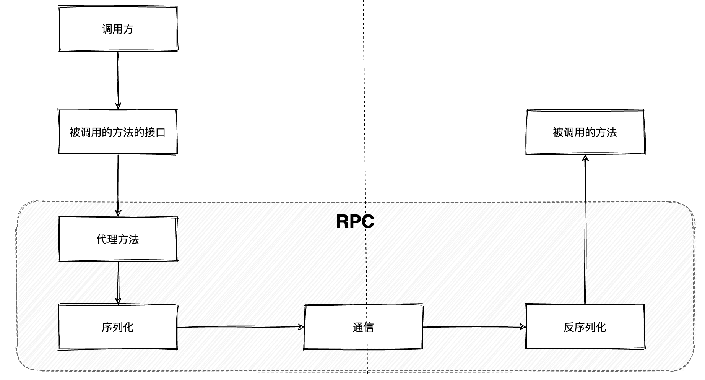
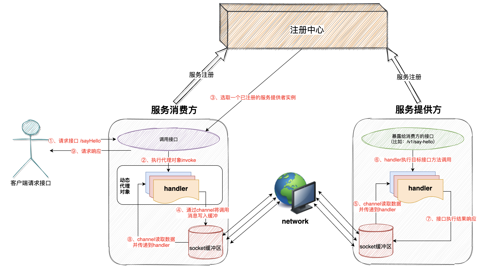
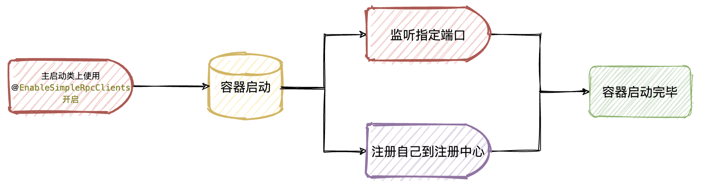
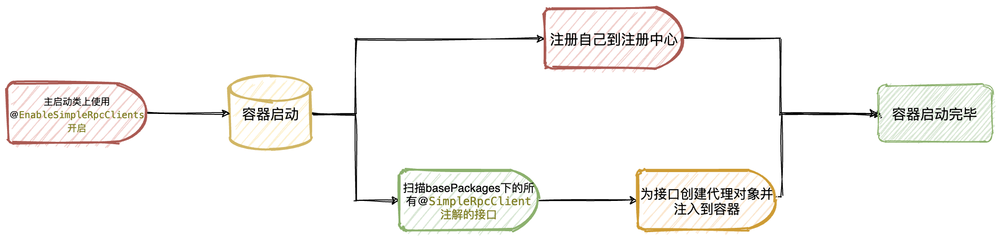

### 项目说明

【 simple-rpc】是一款低性能的rpc服务框架，主要用于学习造轮子！以便于透彻的理解RPC原理和过程，以及springboot、netty中相关技术运用。

- 该项目实现了一个简单rpc调用，使用上类似于feign调用，非常方便，只需要基于一个`[注解 + 接口]`就能完成远程调用。
  - 很多人认为feign是伪RPC，这有一定的道理，参考：[https://www2.zhihu.com/question/298707085](https://www2.zhihu.com/question/298707085)
- 以nacos作为注册中心（后面可拓展为支持多种类型的注册中心）
- 底层基于netty实现【服务提供方】和【服务消费方】进行通信，并且使用自定义消息编码解码器（`MessageCodecSharable`和`ProtocolFrameDecoder`）解决消息粘包和半包问题
  - 自定义rpc请求消息和rpc响应消息的编码解码器`LengthFieldBasedFrameDecoder`，自定义消息发送的格式。
  - 自定义帧解码器(预设长度解码器)`ProtocolFrameDecoder`，按自定义规则解码入站消息。
- 基于netty提供的promise进行异步rpc调用，调用方并不用同步等待结果响应
- 动态可插拔，基于`@EnableSimpleRpcClients`注解开启或关闭simple rpc功能
- 在调用方只需要在`xxx.xxx.xxx`包下编写一个和服务提供方一样的接口，然后在启动类上使用`@EnableSimpleRpcClients(basePackages = "xxx.xxx.xxx")`即可将所有的需要远程调用的接口扫描并注册到容器
- 调用方只需要在需要远程调用的类中使用`@Autowired`注解注入接口即可调用该接口提供的方法（像调用本地方法一样去进行远程调用）

### 启动步骤

首先要搞清楚如何将项目先正常跑起来，测试一把然后再去关注具体实现！

- 拉取项目到本地，并且在idea中打开[https://gitee.com/mr_wenpan/basis-simple-rpc](https://gitee.com/mr_wenpan/basis-simple-rpc)
- 将`simple-rpc-starter`模块执行`mvn clean install`到本地maven仓库
- `simple-rpc-provider`和`simple-rpc-consumer`这两个测试模块的`application.yml`配置文件中开启相关配置
  - 主要配置simple rpc server端监听的端口（默认8888端口）
  - rpc调用最大等待时间（默认1分钟）
  - nacos注册中心地址
- `simple-rpc-provider`和`simple-rpc-consumer`模块启动类上使用`@EnableSimpleRpcClients`注解开启simple rpc功能，可自定义扫描的包，如果不指定则默认扫描当前classpath下
- 启动`simple-rpc-provider`模块
- 启动`simple-rpc-consumer`模块
- 浏览器请求接口：[http://localhost:8081/v1/consumer-hello?name=xxxx](http://localhost:8081/v1/consumer-hello?name=wenpan)
- 观察浏览器返回和两个服务的控制台输出

当然上面的步骤在工程源代码里已经配置好了，只需要把代码拉下来，然后将nacos地址替换掉，直接启动运行就可以了。

### RPC简单介绍

- 首先了解一下RPC的大体流程
- 相关理论介绍
  - [用通俗的语言解释一下什么是 RPC 框架？](https://www.zhihu.com/question/25536695)
  - [浅谈RPC调用](https://www.cnblogs.com/linlinismine/p/9205676.html)
  - [远程过程调用(RPC)详解)](https://my.oschina.net/waylau/blog/709372)
  - [通俗的解释一下什么是 RPC 框架？](https://cloud.tencent.com/developer/article/1165885)

### simple rpc整体结构

### 服务提供方启动流程简述

### 服务消费方启动流程简述

### 待优化项

- 目前只支持nacos作为注册中心
- 服务实例和注册中心进行心跳检查时，如果不能正常通信需要及时清理本地缓存
- 消费方和服务提供方的接口名称必须要一致（这个bug后期优化）
- 消息序列化可支持多种序列化算法动态配置（目前只支持java序列化和JSON序列化配置）
- 可支持多种调用模式（比如底层直接使用httpClient去调用或使用netty去通信）
- 程序启动时 netty server端的启动监听端口不需要配置文件指定，而是采用随机选取一个未使用的端口进行监听并注册到注册中心

